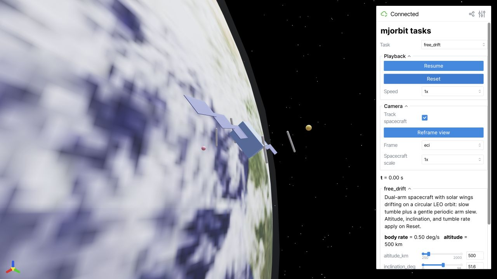

# Browser viewer

The CPU task viewer runs a local Viser server. It requires a browser with
WebGL support, and does not require an NVIDIA GPU or a policy checkpoint.

```bash
pixi run viewer
# Equivalent explicit selection:
pixi run viewer --task free_drift
```

Open the printed address, normally `http://localhost:8080`. The default
free-drift task shows a dual-arm spacecraft and Earth. Use the task dropdown
to switch demos, **Pause** to stop the simulation, and **Reset** to restore
the task's initial conditions. Task controls appear in the sidebar.



The screenshot uses the bundled NASA Earth Observatory texture; attribution
is recorded in `src/viewer/assets/README.md` and the project `NOTICE`.

## Choose a task

```bash
pixi run viewer --list-tasks
pixi run viewer --task arm_reach_mppi
pixi run viewer --task capture_stabilize_mppi
pixi run viewer --task free_drift --port 8081
```

Arm reach demonstrates a floating base with a controlled arm. Capture and
stabilization uses long-horizon planning and can take substantially longer
per update. Start with free drift to verify installation and rendering.

An installed wheel exposes the same app as `mjo-viewer`. Stop the server with
Ctrl+C in its terminal. If the requested port is occupied, use another port
and open the address printed by that process.

## Custom scenes and recordings

The viewer integration is in `src/viewer/`. Built-in tasks implement the
`ViewerTask` interface and register through `viewer.tasks`; the existing
free-drift task is a small starting point for a custom scenario.

Some paper examples provide dedicated viewers, including
`pixi run example-reorient-viewer`. Deterministic paper recordings are produced
by the source-only tools in `scripts/record/`. They require additional Chrome
and ffmpeg setup; see the
[recording guide](https://github.com/johnzhang3/mjorbit/blob/main/scripts/record/README.md).
